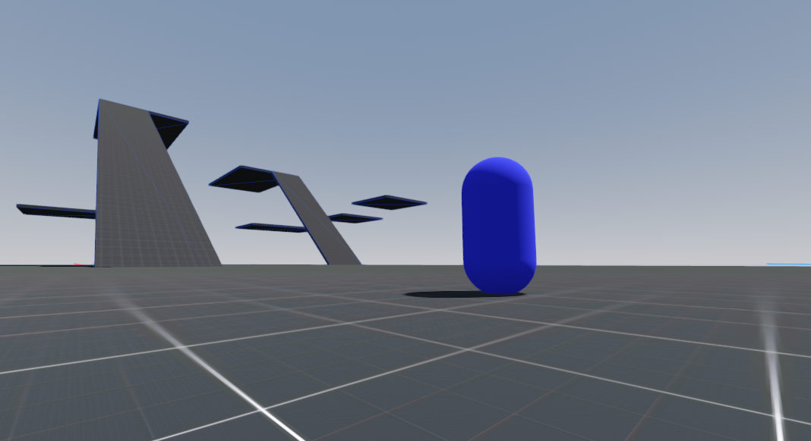

An advanced FPS Controller Template made in Godot 4

# **General**

This template provides a complete, advanced and fully commented controller, camera, as well as a properties HUD

A template map is provided to test the controller.

The controller use a finite state machine, designed to be easely editable, allowing to easily add, remove and modify behaviours and actions.

He is also very customizable, with a whole set of open variables for every state and for more general stuff. This is the same for the camera.

The template is 100% written in GDScript.

He works on Godot 4.3 and Godot 4.2.
I didn't test it in Godot 4.1 and Godot 4.0, but it should work just fine.

Video showcasing the template features : https://www.youtube.com/watch?v=qdmzIYgVb1E

# **Features**

 - Smooth moving
 - Walking
 - Crouching
 - Running
 - Jumping (multiple jump system)
 - Air control
 - Sliding (and air slide)
 - Dashing
 - Bunny hopping
 - Wall running

 - Camera tilt
 - Camera bob
 - Custom smooth FOV
   
 - Crosshair
 - Properties HUD

# **Controls**

All keys bindings can be modified

- W, S, A, D (alternatively : up, down, left, right) = move / wall run
- Space = jump
- Left shift = run
- C = crouch / slide
- Left control = dash
- Escape = mouse control

  
# **Purpose**

My main goal with this project was to provide a complete and easy to manage/modify controller for FPS games (It can be apply to first person games in general, even if the movement list has been thinking as an FPS one)

I hope that it will be the case.

I didn't found any bug during the last tests, but i probably missed out a few, so if you find out a bug, feel free to tell me in response to my comment in the showcase video.

# **How to use**

This plugin is a template, which means it's a project that has been designed to be a base of a new project, not an addon to an existing one.

So to correctly use it, you simply have to download it, and then import the project on the Godot app welcome page, and that's all !
 
 
